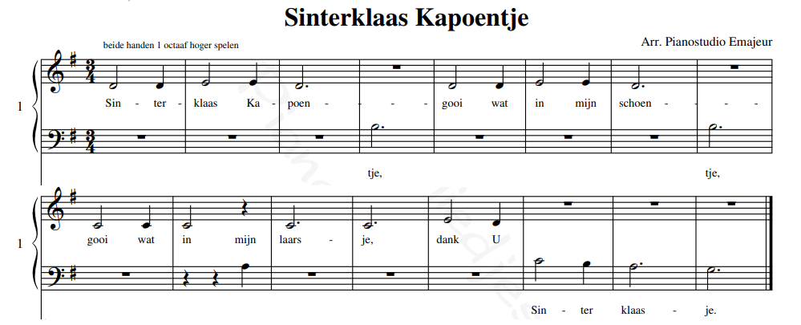

Met Sonic Pi kun je muziek programmeren als code! In deze instructie gaan we wat muziek maken, passend in de maand december.

<!--more-->

## Introductie

Sonic Pi is een programma geschreven door Sam Aaron en het Sonic Pi Core team. Je kunt er muziek in programmeren en zelfs
live muziek in aanpassen terwijl het speelt!

In deze instructie leren we hoe je muziek kunt maken in Sonic Pi op basis van bladmuziek van eenvoudige liedjes passend
in de maand december. We maken Sinterklaas Kapoentje en Klink klokje klingelingeling. Je leert ook hoe je zelf op basis
van bladmuziek muziek kunt programmeren.

## Wat heb je nodig?



## Twee voorbeelden

We hebben 2 voorbeelden uitgewerkt voor gebruik in Sonic Pi.  
De voorbeelden komen beide van https://www.pianokinderliedjes.nl. 

### Sinterklaas Kapoentje


<a href="https://www.pianokinderliedjes.nl/pdf/Sinterklaas_Kapoentje_4handig_inG.pdf">https://www.pianokinderliedjes.nl/pdf/Sinterklaas_Kapoentje_4handig_inG.pdf</a> 

Hieronder staat de code voor dit liedje. We beginnen te bepalen met welke snelheid het liedje gespeeld wordt en met welke klank:

- `use_bpm` bepaalt de snelheid, in dit geval 120 beats-per-minute. Speel eens met de waarde en kijk wat er gebeurd.
- `use_synth` bepaalt de klank, in dit geval piano. Andere klinken vind je

Daarna schrijven we de noten uit de bladmuziek hierboven: 

- `play :g4` speelt een G in de 4e octaaf
- `sleep 0.66` bepaalt de duur van de noot (niet van de klank), in dit geval 0,66 seconden

Beide instructies kunnen op hun eigen regel, maar als ze samen op één regel staan, moet er een ; (punt-komma) tussen.

<details>
<summary>hier</summary>
<pre>
    :dull_bell
    :pretty_bell
    :beep
    :sine
    :saw
    :pulse
    :subpulse
    :square
    :tri
    :dsaw
    :dpulse
    :dtri
    :fm
    :mod_fm
    :mod_saw
    :mod_dsaw
    :mod_sine
    :mod_beep
    :mod_tri
    :mod_pulse
    :tb303
    :supersaw
    :hoover
    :prophet
    :zawa
    :dark_ambience
    :growl
    :hollow
    :mono_player
    :stereo_player
    :blade
    :piano
    :pluck
    :sound_in
    :noise
    :pnoise
    :bnoise
    :gnoise
    :cnoise
    :basic_mono_player
    :basic_stereo_player
    :basic_mixer
    :main_mixer
</details>

```bash
    use_bpm 120
    use_synth :piano

    # Sin - ter
    play :g4; sleep 0.66
    play :g4; sleep 0.33
    # klaas - Ka
    play :a4; sleep 0.66
    play :a4; sleep 0.33
    # poen
    play :g4; sleep 1.0
    # tje,
    play :e4; sleep 1.0
    
    # gooi - wat
    play :g4; sleep 0.66
    play :g4; sleep 0.33
    # in - mijn
    play :a4; sleep 0.66
    play :a4; sleep 0.33
    # schoen
    play :g4; sleep 1.0
    # tje
    play :e4; sleep 1.0
    
    # gooi - wat
    play :f4; sleep 0.66
    play :f4; sleep 0.33
    # in - mijn
    play :f4; sleep 0.66
    play :d4; sleep 0.33
    # laars
    play :f4; sleep 1.0
    # je
    play :f4; sleep 1.0
    
    # dank - u
    play :a4; sleep 0.66
    play :g4; sleep 0.33
    # sin - ter
    play :f4; sleep 0.66
    play :e4; sleep 0.33
    # klaas
    play :d4; sleep 1.0
    # je
    play :c4; sleep 1.0

```

## Zelf aan de slag

## Goed gedaan!

Meer muziek: https://www.pianokinderliedjes.nl/index.php  
Tutorial: https://sonic-pi.net/tutorial.html


